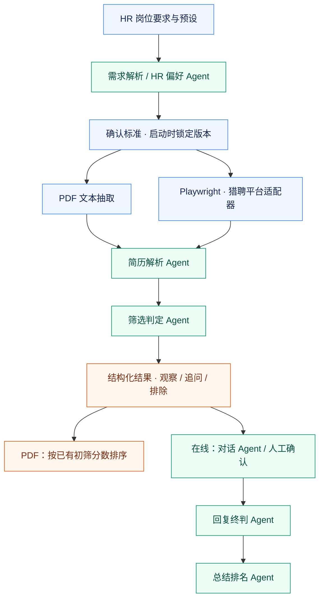

<div align="center">


# HRagent

**招聘需求 → 简历筛选 → 候选人跟进 → 结果汇总**

面向个人与受控内部环境的招聘 Agent 工作台。<br />
用自然语言表达招聘要求，让 Agent 分工处理，让 HR 保留最终判断。

[](https://github.com/DorianYoung7702/HRagent/actions/workflows/ci.yml)
[](#使用边界)
[](pyproject.toml)
[](apps/console-web/package.json)
[](LICENSE)

[核心能力](#核心能力) · [Agent 架构](#agent-架构) · [快速开始](#快速开始) · [数据与隐私](#数据与隐私) · [文档导航](#文档导航)

</div>

---

## 核心能力

HRagent 将重复的简历阅读、标准对照、信息追问与结果整理连接为可查看进度的工作流，而不是只提供一个简历问答窗口。

| 环节 | 提供的能力 |
| --- | --- |
| **表达招聘需求** | 自然语言解析岗位要求，通过偏好对话整理硬性条件、加分项、快速淘汰项与追问项；岗位预设可复用 |
| **获取候选人资料** | 批量导入文本 PDF，或通过猎聘 LPT 的 Playwright 适配器搜索、打开与抽取在线简历 |
| **逐份解析与筛选** | 解析 Agent 与判定 Agent 分工，输出结构化资料、匹配分、判定理由及待补充信息 |
| **跟进候选人** | 基于岗位资料回答白名单内问题；资料不足时生成草稿或转人工，保留对话与处理状态 |
| **汇总筛选结果** | 候选人按“观察 / 追问 / 排除”归类；PDF 复用初筛分数排序，回复终判流程可生成排名与总结报告 |
| **查看执行过程** | SSE 实时日志、任务进度、历史记录，以及 SQLite 备份、维护与诊断工具 |

### 两种使用入口

| | 批量 PDF 筛选 | 猎聘在线筛选 |
| --- | --- | --- |
| **输入** | 本地有文本层的 PDF 简历 | 已获授权的猎聘企业账号与搜索条件 |
| **执行方式** | 文本抽取 → AI 解析 → AI 判定 | Playwright 搜索与抽取 → AI 解析与判定 |
| **后续处理** | 候选清单、按初筛分数综合排序 | 收藏、IM 跟进、回复终判与总结 |
| **浏览器依赖** | 无，可独立使用 | 需要 Chromium 和有效登录态 |

> **当前状态：Beta。** BOSS 仅有平台扩展入口，真实 RPA 尚未接入。项目不隶属于招聘平台，内置岗位均为虚构示例。

## Agent 架构

**Agent 负责理解与判断，工作流负责串联任务，平台适配器负责浏览器操作。**



图中 PDF 与在线跟进是不同处理路径；PDF 排序不额外调用模型，回复终判与总结排名串行执行。

### 技术分层

| 层次 | 技术 | 职责 |
| --- | --- | --- |
| 控制台 | Vue 3 · TypeScript · Vite | 岗位配置、候选清单、对话、排名与实时日志 |
| API 与任务 | FastAPI · HTTP / SSE · asyncio | 接口服务、后台任务、状态与进度事件 |
| Agent 服务 | Pydantic AI · Pydantic · DeepSeek | 需求理解、结构化解析、筛选判定与对话总结 |
| 数据获取 | Playwright · Chromium · pypdf | 平台页面操作、在线简历抽取与 PDF 文本提取 |
| 持久化 | SQLAlchemy · SQLite | 工作流、候选快照、筛选结果与会话消息 |
| 部署与检查 | Docker Compose · venv · pytest · Ruff | 源码运行、容器部署、自动化检查 |

默认单机流程使用 **asyncio 后台任务 + SQLite**，不需要部署 PostgreSQL、Redis 或 Temporal。仓库另有可选 Temporal 工作流、PostgreSQL 与定时回复接入代码，不代表默认模式具备分布式任务恢复能力。

## 快速开始

### Docker

准备 Docker 与 Compose v2，在终端执行：

```sh
git clone https://github.com/DorianYoung7702/HRagent.git
cd HRagent
docker compose -f infra/docker-compose.standalone.yml up -d --build
```

打开 **[http://127.0.0.1:8001](http://127.0.0.1:8001)**。

1. 配置自己的模型 API Key 和招聘方身份。
2. 编辑岗位要求与筛选偏好，确认本次判定标准。
3. 导入 PDF 开始筛选；在线筛选需先准备平台登录态。
4. 查看实时日志、候选清单与排名，对模型结果进行人工复核。

**部署须知：** 默认仅映射本机端口，无产品激活、设备绑定或授权服务器依赖。SQLite 与运行配置保存在命名卷中，重建镜像不会自动删除数据。容器浏览器以 headless 模式运行，平台登录与 RPA 需另行验证；首次体验可从 PDF 开始。

<details>
<summary><strong>常用命令：查看日志与停止服务</strong></summary>

```sh
# 查看运行日志
docker compose -f infra/docker-compose.standalone.yml logs -f --tail=100

# 停止服务，保留命名卷中的数据
docker compose -f infra/docker-compose.standalone.yml down
```

完整配置见 [Docker 部署说明](docs/DOCKER_STANDALONE.md)。

</details>

<details>
<summary><strong>Windows 源码运行</strong></summary>

建议使用 Python 3.12、Node.js 22 和 Git。在项目目录运行：

```powershell
python -m venv .venv
.\.venv\Scripts\Activate.ps1
python -m pip install -c infra/constraints.docker.txt -e ".[dev]"
python -m playwright install chromium
if (-not (Test-Path .env)) { Copy-Item .env.example .env }
```

已有 `.env` 时保留原文件，不要用示例覆盖。按实际情况配置：

```dotenv
DATABASE_URL=sqlite+aiosqlite:///./data/recruiting.db
API_HOST=127.0.0.1
API_PORT=8001
API_BASE_URL=http://127.0.0.1:8001
DEEPSEEK_API_KEY=your-own-key
HR_COMPANY_NAME=your-own-organization
```

构建控制台并启动后端：

```powershell
Push-Location apps/console-web
npm.cmd ci
npm.cmd run build
Pop-Location
python -m uvicorn apps.api.main:app --host 127.0.0.1 --port 8001
```

访问 [http://127.0.0.1:8001](http://127.0.0.1:8001)。猎聘在线操作需要自己的企业账号登录态。

源码部署、更新、备份与旧数据迁移见 [部署指南](docs/DEPLOYMENT.md)。

</details>

## 使用边界

| 项目 | 当前限制 |
| --- | --- |
| PDF 数量 | 每批最多 **1,000 份** |
| 文件大小 | 单份 **30 MiB**，整批 **5 GiB** |
| 处理并发 | 最多 **10 份候选人**并发处理，不等于 1,000 份同时调用模型 |
| 文本提取 | 每份最多前 **30 页 / 50,000 字符**；各 Agent 另有输入长度限制 |
| 文件类型 | 仅有文本层的 PDF；不支持扫描件 OCR 或加密 PDF |
| 平台操作 | 页面变化、验证码与登录风控可能影响执行，不承诺绕过平台限制 |
| 部署形态 | 默认本机单用户，无用户登录与多租户权限体系 |

大批上传需要充足的**内存与临时磁盘空间**，上限不等于对任意硬件的处理能力保证。模型判断、理由和分数用于辅助筛选，不代表准确率承诺，也不替代 HR 决策。

## 数据与隐私

**本地运行不等于模型离线运行。** 解析与判定所需的简历文本会发送到你配置的模型服务。

| 数据 | 默认处理方式 |
| --- | --- |
| 上传的 PDF | 以序号命名临时落盘；完成、失败或取消后尝试清理，服务重启清理遗留队列 |
| PDF 原文、原文件名与去重 hash | 不写入业务数据库；结构化筛选结果与工作流记录会保留 |
| 在线简历与 IM | 候选快照可能包含简历原文，对话记录保存在本地业务数据库 |
| 跨任务人才档案 | **默认关闭**；显式启用后非淘汰候选可归档，删除任务不会删除独立档案 |
| API Key 与平台登录态 | 本机配置与浏览器 profile，不应提交仓库或随安装包分发 |

临时文件删除不等于磁盘安全擦除；模型服务商的数据处理遵循其自身政策。公开反馈请使用合成数据，不要上传真实简历、聊天全文、Cookie、密钥、完整数据库或内部材料。

公共网络部署需要另外配置 HTTPS 与身份验证网关。完整保存、归档和删除边界见 [数据与隐私说明](docs/DATA_PRIVACY.md)。

## 开发与贡献

安装开发依赖后，先构建前端，再运行检查，与 CI 顺序保持一致：

```sh
npm --prefix apps/console-web ci
npm --prefix apps/console-web run build
python -m pytest -q
python -m ruff check apps services packages scripts tests
python -m compileall -q apps services packages scripts
python scripts/check_public_release.py
```

CI 使用 mock 与合成数据，不访问真实招聘账号、不调用付费模型、不发送候选人消息。**测试通过不等于真实平台 E2E 验证。** 发布检查用于辅助检查受版本控制的文件，不替代人工审查。

欢迎提交可复现的问题、平台适配修复和测试。参与前请阅读 [贡献指南](CONTRIBUTING.md)，安全问题请按 [安全指引](SECURITY.md) 报告。

## 文档导航

| 文档 | 内容 |
| --- | --- |
| [HR 操作手册](docs/HR_USER_OPERATING_MANUAL.md) | 岗位配置、筛选与跟进操作 |
| [Docker 部署](docs/DOCKER_STANDALONE.md) | 容器配置、运行与维护 |
| [部署指南](docs/DEPLOYMENT.md) | 源码启动、版本更新、备份与旧数据迁移 |
| [数据与隐私](docs/DATA_PRIVACY.md) | 数据保存、人才档案与清理边界 |
| [公开发布说明](SOURCE_PUBLICATION.md) | 公共版本范围与发布注意事项 |
| [贡献指南](CONTRIBUTING.md) · [安全指引](SECURITY.md) | 开发协作与问题反馈 |

---

### License

[MIT](LICENSE) · 第三方依赖遵循其各自许可证。平台账号、页面内容和用户上传数据不因本项目许可证获得额外授权。
