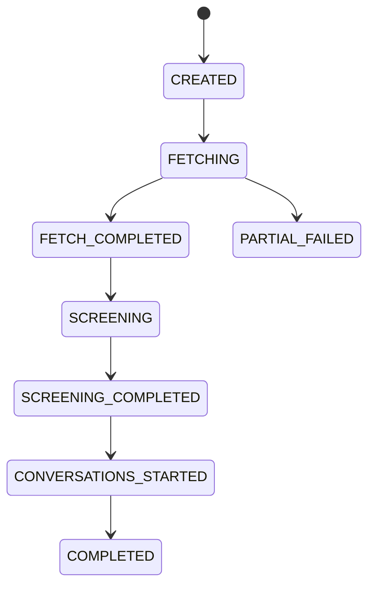

# 招聘多 Agent 协作系统 — 技术文档

> 版本：0.2.0  
> 最后更新：2026-06-05  
> 仓库：https://github.com/DorianYoung7702/HRagent

---

## 1. 项目概述

本系统是一个 **Workflow 驱动的招聘自动化平台**，面向猎聘 LPT（`lpt.liepin.com`）企业招聘场景，将浏览器抓取、AI 初筛、IM 追问与多轮回复闭环整合为可编排的长流程任务。

**核心设计原则：**

| 层次 | 职责 | 技术选型 |
|------|------|----------|
| 控制台 | HR 可视化操作、实时日志 | Vue 3 + Vite |
| 接口层 | REST API、SSE 事件流、静态资源托管 | FastAPI |
| 编排层 | 长流程状态管理、重试、超时 | Temporal（可选） |
| 抓取层 | 确定性 DOM 操作，不依赖 LLM | Playwright |
| 智能层 | 搜索解析、筛选、私信、回复解析 | Pydantic AI + DeepSeek |
| 持久层 | 候选人快照、筛选结果、会话记录 | PostgreSQL / SQLite |

**LPT 说明：** LPT（Liepin Platform for Talent）即猎聘 **企业版** 后台（`lpt.liepin.com`），供 HR 搜索人才、查看在线简历、发起 IM 沟通。与 C 端 `www.liepin.com` 不同。

---

## 2. 系统架构

### 2.1 整体架构图

```text
┌──────────────────────────────────────────────────────────────────┐
│  HR 用户                                                          │
│  console-web (Vue3)  │  curl / Admin UI  │  脚本                  │
└──────────┬───────────┴─────────┬─────────┴────────────────────────┘
           │ HTTP / SSE          │ HTTP
┌──────────▼─────────────────────▼──────────────────────────────────┐
│                    FastAPI (apps/api)                              │
│  /workflows  /browser  /followup  /conversations  /health        │
│  StaticFiles → console-web/dist (生产模式)                         │
│  BackgroundTasks (轻量)  │  Temporal Client (完整模式)               │
└───────┬──────────────────────────────┬────────────────────────────┘
        │                              │
        │                              ▼
        │              ┌───────────────────────────────┐
        │              │   Temporal Server              │
        │              │   RecruitingWorkflow           │
        │              │   CandidateConversationWorkflow│
        │              └───────────┬───────────────────┘
        │                          │ Activities
        ▼                          ▼
┌───────────────┐  ┌────────────────────┐  ┌─────────────────────┐
│ fetch_worker  │  │  agent_service     │  │ reply_ingestion     │
│ Playwright    │  │  Pydantic AI       │  │ APScheduler 定时扫  │
│ LPT/IM 抓取   │  │  解析/判定/追问    │  │ 平台聊天回复        │
└───────┬───────┘  └─────────┬──────────┘  └──────────┬──────────┘
        │                    │                         │
        └────────────────────┼─────────────────────────┘
                             ▼
              ┌──────────────────────────────┐
              │  packages/db (SQLAlchemy)     │
              │  packages/schemas (Pydantic)  │
              │  packages/workflow_events     │
              └──────────────────────────────┘
                             │
              ┌──────────────┴──────────────┐
              │ PostgreSQL (生产/Docker)     │
              │ SQLite (本地 Demo)           │
              └─────────────────────────────┘
```

### 2.2 三种运行模式

| 模式 | 启动方式 | 前端 | 适用场景 |
|------|----------|------|----------|
| 生产网页模式 | `start_console_prod.ps1` | 构建后挂载于 `:8000` | 局域网 HR 访问、生产演示 |
| 开发模式 | `start_console.ps1` | Vite `:5173` + API `:8000` | 本地开发、热更新 |
| API/脚本模式 | `start_api.ps1` + curl/脚本 | 无或使用 Admin UI | 自动化集成、Temporal 栈 |

### 2.3 轻量 vs Temporal

| 模式 | 触发方式 | 编排 | 适用场景 |
|------|----------|------|----------|
| 轻量模式 | `POST /workflows/demo/liepin-lpt/start`（默认） | FastAPI `BackgroundTasks` | 控制台、本地 Demo |
| Temporal 模式 | `use_temporal=True` 或 Docker 栈 | Temporal Workflow + Activities | 生产环境、多轮私信闭环 |

轻量模式下，抓取与初筛通过 `apps/api/job_runner.py` 在 API 进程内异步执行；Temporal 不可用时自动降级。

---

## 3. 技术栈

| 类别 | 依赖 | 版本要求 |
|------|------|----------|
| 语言 | Python | ≥ 3.11 |
| 前端 | Vue 3, Vite, TypeScript | — |
| Web 框架 | FastAPI, Uvicorn | ≥ 0.115 |
| ORM | SQLAlchemy (async) | ≥ 2.0 |
| 数据库驱动 | asyncpg, aiosqlite | — |
| 迁移 | Alembic | ≥ 1.14 |
| 浏览器自动化 | Playwright | ≥ 1.49 |
| AI 框架 | pydantic-ai, openai | — |
| 工作流引擎 | temporalio | ≥ 1.7 |
| 定时任务 | APScheduler | ≥ 3.10 |
| 模板 | Jinja2 | ≥ 3.1 |
| 缓存（预留） | Redis | ≥ 5.2 |

LLM 通过 **DeepSeek OpenAI 兼容 API** 接入，项目统一使用 `deepseek-v4-flash`。

---

## 4. 目录结构

```text
hr_agent/
├── apps/
│   ├── api/                    # FastAPI 应用
│   │   ├── main.py             # 入口、CORS、控制台静态挂载
│   │   ├── job_runner.py       # 轻量模式后台任务
│   │   ├── temporal_client.py
│   │   └── routes/
│   │       ├── workflows.py    # Workflow + 搜索解析 + SSE
│   │       ├── followup.py     # IM 追问 API
│   │       ├── browser_setup.py# 猎聘登录 API
│   │       ├── candidates.py
│   │       ├── conversations.py
│   │       └── messages.py
│   ├── console-web/            # Vue3 控制台 SPA
│   │   └── src/components/     # SearchForm, CandidateList, FollowupPanel...
│   └── admin-web/templates/    # Jinja2 管理后台
├── services/
│   ├── fetch_worker/           # Playwright 抓取、IM、登录
│   ├── agent_service/          # Pydantic AI Agents
│   ├── workflow_worker/        # Temporal Workflows & Activities
│   └── reply_ingestion_worker/
├── packages/
│   ├── schemas/                # Pydantic 契约
│   ├── db/                     # Models, Repositories, schema_upgrade
│   ├── settings.py
│   ├── screening_defaults.py   # 默认 HR 评判标准
│   ├── workflow_events.py      # SSE 事件总线
│   └── workflow_control.py
├── alembic/versions/
│   ├── 001_initial_schema.py
│   └── 002_outreach_im_fields.py
├── docs/
├── infra/                      # Docker Compose
├── scripts/
└── tests/
```

---

## 5. 核心业务流程

### 5.1 控制台筛选流程（主路径）

```text
1. HR 填写搜索需求 + 评判标准
2. POST /workflows/parse-search-intent  →  SearchIntentAgent 解析关键词/城市/年限
3. POST /workflows/demo/liepin-lpt/start →  创建 Workflow，后台启动抓取
4. fetch_worker: LPT 搜索 → 弹窗简历抽取 → 逐卡 AI 初筛
5. workflow_events → SSE 推送日志到控制台
6. finalize_shortlist → 控制台展示候选人清单
7. IM 自动触达：开聊后 Agent 判定追问/要简历并立即发送，后台同步回复并自动跟进
```

### 5.2 两阶段 AI 初筛

每张简历卡片抓取完成后立即初筛（`auto_screen=true`）：

```text
简历原文 + 结构化字段
        │
        ▼
 resume_parser_agent     解析在线简历 → ResumeParseOutput
        │                 （总结、要点、结构化字段）
        ▼
 screening_decision_agent  对照 HR 评判标准 → ScreeningDecisionOutput
        │                 （观察 / 追问 / 排除 + 理由 + 标准对照）
        ▼
 merge → VisaScreeningOutput → 持久化 + SSE 日志
```

入口函数：`services/agent_service/visa_screening_agent.py::screen_visa_only()`

**初筛结论：**

| decision | 含义 | 后续动作 |
|----------|------|----------|
| 观察 | 硬性条件基本满足 | 先开聊 → IM 索要简历 |
| 追问 | 关键信息缺失（如美签） | 先开聊 → IM 追问 |
| 排除 | 硬性条件不满足 | 不再跟进 |

默认 HR 评判标准见 `packages/screening_defaults.py`。

### 5.3 LPT 弹窗抓取流程

`search.mode = "lpt_search"`：

1. 打开 `https://lpt.liepin.com/search`，填写关键词/城市/经验
2. 等待搜索结果卡片（`lpt_search.py`）
3. 逐张点击卡片 → 弹窗在线简历（`extract_popup.py`）
4. 抽取工作经历、项目经历、教育经历等字段
5. 可选立即开聊（`followup_pending` 标记）
6. 逐卡 AI 初筛 → 汇总 shortlist

### 5.4 Temporal 招聘主流程



### 5.5 候选人多轮对话（Temporal 子 Workflow）

```text
创建会话 → 生成私信 → 发送/草稿 → 等待回复 (signal)
    ↑                                      │
    └──── 解析回复 → 更新画像 → 二次筛选 ←──┘
```

---

## 6. 模块详解

### 6.1 API 层

**入口：** `apps/api/main.py`

- 启动时执行 `ensure_schema_upgrades()`（SQLite 增量字段）
- 生产模式挂载 `console-web/dist` 至 `/`
- CORS 允许 localhost 与局域网私有 IP
- `AgentInferenceError` → HTTP 503

| 路由前缀 | 文件 | 功能 |
|----------|------|------|
| `/workflows` | `workflows.py` | Workflow CRUD、搜索解析、SSE、Demo |
| `/workflows/{id}/followup` | `followup.py` | IM 追问全流程 |
| `/browser` | `browser_setup.py` | 远程猎聘登录 |
| `/candidates` | `candidates.py` | 候选人查询 |
| `/conversations` | `conversations.py` | 会话与回复入库 |
| `/outreach_messages` | `messages.py` | 私信确认发送 |
| `/admin` | `main.py` | Jinja2 管理后台 |
| `/health` | `main.py` | 健康检查 |
| `/health/deepseek` | `main.py` | DeepSeek 连通性 |

**关键端点：**

| 方法 | 路径 | 说明 |
|------|------|------|
| POST | `/workflows/parse-search-intent` | 自然语言 → 猎聘参数 + 保留评判标准 |
| POST | `/workflows/demo/liepin-lpt/start` | 异步启动（控制台，非阻塞） |
| POST | `/workflows/demo/liepin-lpt/run-visible` | 同步 Demo（阻塞至完成） |
| GET | `/workflows/{id}/events` | 轮询任务日志 |
| GET | `/workflows/{id}/events/stream` | SSE 实时日志流 |
| GET | `/workflows/{id}/candidates` | 候选人 + 筛选结果 |
| POST | `/workflows/{id}/followup/im-prepare` | 生成 IM 追问草稿 |
| POST | `/workflows/{id}/followup/im-send` | 确认发送 IM |
| POST | `/workflows/{id}/followup/scan-unread` | 扫描未读回复 |
| POST | `/workflows/{id}/followup/continue` | 一键继续追问流程 |
| POST | `/workflows/{id}/observe/im-request-resume` | 观察名单索要简历 |
| GET | `/browser/login/status` | 登录态检查 |
| POST | `/browser/login/start` | 打开猎聘登录页（保留已有缓存） |
| POST | `/browser/login/relogin` | 清除 profile 缓存并重新打开登录页 |
| POST | `/browser/login/complete` | 用户完成登录后确认保存 |
| POST | `/browser/login/verify` | 重新检测登录态 |

### 6.2 控制台 (`apps/console-web`)

Vue 3 + Vite SPA，主要组件：

| 组件 | 职责 |
|------|------|
| `SearchForm.vue` | 搜索需求、HR 评判标准、智能解析、启动筛选 |
| `TaskStatus.vue` | Workflow 状态展示 |
| `LogConsole.vue` | SSE 日志面板 |
| `CandidateList.vue` | 候选人清单（观察/追问/排除） |
| `FollowupPanel.vue` | IM 自动触达状态与对话记录（只读） |
| `LoginSetup.vue` | 猎聘登录引导（清除并重新登录、检测登录态） |

**API 客户端：** `src/api/index.ts`

生产构建后由 FastAPI `StaticFiles` 托管，与 API 同源，无需 CORS。

### 6.3 事件总线 (`packages/workflow_events.py`)

内存事件总线，支持控制台 SSE 实时日志：

- `emit(level, message, category, workflow_id, meta)` — 各模块写入事件
- `workflow_context(workflow_id)` — ContextVar 自动关联 workflow
- 缓冲区上限 500 条/workflow
- 类别：`system` / `fetch` / `screening` / `im` 等

### 6.4 抓取层 (`services/fetch_worker`)

**设计原则：** DOM 操作由 Playwright 确定性完成，LLM 不参与页面解析。

| 模块 | 职责 |
|------|------|
| `browser.py` / `browser_pool.py` | 浏览器实例与 Profile 管理 |
| `login_init.py` | 本机 profile 登录初始化（清除缓存、打开可见浏览器、验证登录态） |
| `lpt_search.py` | LPT 搜索页自动化 |
| `lpt_adapter.py` | LPT CSS 选择器配置 |
| `extract_popup.py` | 弹窗在线简历抽取（主路径） |
| `extract_list.py` / `extract_detail.py` | 列表/详情页抽取 |
| `extract_monitor.py` | 抓取过程监控 |
| `im_chat_adapter.py` | IM 中心 DOM 适配 |
| `im_chat_runner.py` | IM 批量发送/扫描 Runner |
| `im_contact_match.py` | IM 联系人匹配 |
| `experience_fallback.py` | 工作年限解析兜底 |
| `keyword_fallback.py` | 关键词过滤兜底 |
| `runner.py` | 抓取任务编排入口 |
| `resume_library_nav.py` | 控制台「跳转简历库」导航 |
| `resume_library_row_match.py` | 简历库列表行匹配（纯逻辑，可单测） |

> **Playwright 操作与扩展指南**（如何加选择器、插步骤、调试截图）见 [docs/PLAYWRIGHT.md](./PLAYWRIGHT.md)。

**抓取模式：**

| mode | 说明 |
|------|------|
| `lpt_search` | LPT 搜索 + 弹窗抓取（推荐） |
| `url_direct` | 直接访问列表 URL 翻页抓取 |

### 6.5 AI Agent 层 (`services/agent_service`)

所有 Agent 基于 **Pydantic AI**，输出严格结构化 Model。

| Agent | 文件 | 输入 | 输出 |
|-------|------|------|------|
| 搜索解析 | `search_intent_agent.py` | 自然语言需求 + HR 标准 | `SearchIntentOutput` |
| 简历解析 | `resume_parser_agent.py` | 简历原文 | `ResumeParseOutput` |
| 初筛判定 | `screening_decision_agent.py` | 解析结果 + HR 标准 | `ScreeningDecisionOutput` |
| 两阶段编排 | `visa_screening_agent.py` | 解析→判定 | `VisaScreeningOutput` |
| 通用初筛 | `screening_agent.py` | JD + 简历 | `ScreeningOutput` |
| 追问话术 | `followup_conversation_agent.py` | 缺口 + 轮次 | 追问文案 |
| 回复 enrichment | `followup_reply_enrichment_agent.py` | IM 回复 | 结构化字段回写 |
| 要简历 | `resume_request_agent.py` | 观察名单 | 索要简历话术 |
| 私信 | `outreach_agent.py` | 缺口 + 轮次 | `OutreachMessageOutput` |
| 回复解析 | `reply_parser_agent.py` | 原始回复 | `ReplyParserOutput` |
| 二次筛选 | `rescreening_agent.py` | 合并画像 | `RescreeningOutput` |

**LLM 客户端：** `llm.py` — 统一 DeepSeek 配置，`DEEPSEEK_TRUST_ENV=false` 避免 Windows 代理导致 ConnectError。

**搜索解析 Agent 设计要点：**

- `keywords` 仅含猎聘搜索栏宽泛词（岗位、语言方向），不含 HR 标准中的行业细项
- `screening_criteria` 原样保留，供初筛判定 Agent 使用
- AI 失败时 `rule_based_parse()` 规则兜底

**猎聘筛选项（`SearchIntentOutput` / `LiepinSearchConfig`）：**

| 字段 | 说明 |
|------|------|
| `current_cities` | 目前/现居城市（RPA：目前城市 → 其他 → 卡片） |
| `cities` / `city` | 期望城市 |
| `experience` | 工作年限 |
| `education.degree` | 教育行学历 chip |
| `education.school_tiers` | 院校要求 985/211/双一流/海外留学 |
| `other_filters.*` | 其他筛选行：活跃/求职/跳槽/年龄/性别/语言/行业 |

RPA 实现见 `lpt_city_picker.py`、`lpt_education_filter.py`、`lpt_other_filters.py`；未解析或点击失败则跳过，不阻断抓取。

### 6.6 IM 自动触达模块

| 模块 | 路径 |
|------|------|
| IM 适配器 | `fetch_worker/im_chat_adapter.py` |
| IM Runner | `fetch_worker/im_chat_runner.py` |
| 自动编排 | `agent_service/im_autopilot.py` |
| 会话/草稿 | `agent_service/followup_conversation_service.py` |
| API（兼容） | `api/routes/followup.py` |
| 控制台（只读） | `console-web/src/components/FollowupPanel.vue` |

**流程（全自动，无需人工点按钮）：**

1. 抓取判定「追问」或「观察」→ **必须先「立即开聊」**（否则 IM「我发起的」无法匹配）→ await `schedule_auto_im_outreach` 发追问/要简历 → 回到列表 → 下一张
2. 初筛完成后 `run_post_screening_im_autopilot` 补发遗漏并启动定期跟进
3. `run_im_autopilot_cycle`：同步 IM 回复 → `FollowupReplyEnrichmentAgent` 回写 → Agent 判定继续追问或改索要简历
4. HR 仅在启动前填写需求；控制台 `FollowupPanel` 仅展示会话状态与对话记录

**回复判定 Agent（手动，独立标签页）：**

| 模块 | 路径 |
|------|------|
| 串行编排 | `agent_service/reply_judgment_runner.py` |
| 回复 enrichment | `agent_service/followup_reply_enrichment_agent.py` |
| API | `POST/GET .../reply-judgment/{start,stop,status,queue}` |
| 控制台 | `console-web/src/components/ReplyJudgmentPanel.vue` |

1. HR 在「回复判定」标签页手动启动
2. 串行：拉取 IM 回复 → `FollowupReplyEnrichmentAgent` 补充画像 → 终判（observe/followup/exclude）
3. 不自动发下一轮追问；全部候选人处理完进入**待机**

### 6.7 Temporal Worker

```bash
python -m services.workflow_worker.main
```

- `RecruitingWorkflow` — 主招聘流程
- `CandidateConversationWorkflow` — 单候选人多轮对话
- Activities 定义于 `activities.py`

### 6.8 回复采集 Worker

```bash
python -m services.reply_ingestion_worker.main
```

APScheduler 定时扫描 `WAITING_REPLY` 会话，Playwright 读取平台回复，POST 至 API 并 signal Temporal Workflow。

---

## 7. 数据模型

### 7.1 ER 关系

```text
RecruitingWorkflow (1) ──< CandidateSnapshot
        │                        │
        │                        ├── CandidateScreeningResult
        │                        ├── CandidateSupplementalInfo
        │                        └── CandidateProfileCurrent
        │
        ├── Shortlist ──< ShortlistCandidate
        │
        └── OutreachConversation ──< OutreachMessage
              (+ conversation_type, im_contact_key, need_resume_request)
```

### 7.2 核心表

| 表名 | 用途 |
|------|------|
| `recruiting_workflows` | Workflow 元数据、状态、config JSON |
| `candidate_snapshots` | 简历快照（结构化字段 + raw_text + metadata） |
| `candidate_screening_results` | 初筛/复筛（支持 `screening_round`） |
| `shortlists` / `shortlist_candidates` | shortlist 排名 |
| `outreach_conversations` | 会话状态机（含 IM 字段，migration 002） |
| `outreach_messages` | 入站/出站消息 |
| `candidate_supplemental_info` | 回复提取的补充信息 |
| `candidate_profiles_current` | 合并画像 |

### 7.3 Workflow 配置示例

```json
{
  "fetch": {
    "target_count": 20,
    "search": {
      "mode": "lpt_search",
      "keywords": "西班牙语 海外销售",
      "city": "深圳",
      "experience": "3-5年",
      "auto_screen": true
    }
  },
  "job": {
    "job_id": "demo_job",
    "description": "搜索需求原文",
    "screening_criteria": "HR 评判标准全文..."
  },
  "screening": { "top_k": 10, "min_score": 60 },
  "outreach": { "enabled": false }
}
```

---

## 8. 配置参考

| 变量 | 默认值 | 说明 |
|------|--------|------|
| `DATABASE_URL` | PostgreSQL URL | Demo：`sqlite+aiosqlite:///./data/recruiting.db` |
| `DEEPSEEK_API_KEY` | — | **必填** |
| `DEEPSEEK_MODEL` | `deepseek-v4-flash` | 勿随意更改 |
| `DEEPSEEK_TIMEOUT` | `120` | API 超时（秒） |
| `DEEPSEEK_TRUST_ENV` | `false` | 忽略系统 HTTP 代理 |
| `TEMPORAL_HOST` | `localhost:7233` | Temporal 地址 |
| `BROWSER_HEADLESS` | `true` | Demo 建议 `false` |
| `BROWSER_PROFILE_DIR` | `./data/browser_profiles/hr_default` | 登录 Profile |
| `SEND_MODE` | `draft_first` | 私信：`draft_first` / `auto_send` |
| `API_HOST` / `API_PORT` | `0.0.0.0` / `8000` | API 监听 |
| `REPLY_SCAN_INTERVAL_MINUTES` | `5` | 回复扫描间隔 |

`BROWSER_HEADLESS` 支持运行时环境变量覆盖（`is_browser_headless()`）。

---

## 9. 部署与运行

### 9.1 本地 Demo（SQLite，无 Docker）

```powershell
pip install -e ".[dev]"
playwright install chromium
copy .env.example .env
.\scripts\setup_local.ps1
.\scripts\login_liepin.ps1
.\scripts\start_console_prod.ps1
```

### 9.2 开发模式

```powershell
.\scripts\start_console.ps1
# 前端 http://localhost:5173  API http://localhost:8000
```

### 9.3 Docker 完整栈

```powershell
.\scripts\start_infra.ps1
.\scripts\migrate.ps1
docker compose -f infra/docker-compose.yml up -d
```

| 服务 | 端口 |
|------|------|
| api | 8000 |
| temporal-ui | 8080 |
| postgres | 5432 |
| temporal | 7233 |

### 9.4 数据库迁移

```bash
alembic upgrade head
```

- `001` — 初始 schema
- `002` — outreach_conversations IM 字段

SQLite 模式下 `schema_upgrade.py` 在 API 启动时自动补全缺失列。

---

## 10. 开发指南

### 10.1 测试与 lint

```bash
pip install -e ".[dev]"
pytest tests/
ruff check .
```

### 10.2 添加新 Agent

1. `packages/schemas/` 定义输出 Model
2. `services/agent_service/` 创建 Agent（参考 `screening_decision_agent.py`）
3. Service 层封装调用，必要时在 `workflow_events` 发 SSE 日志
4. Temporal 集成则在 `activities.py` 添加 Activity

### 10.3 调试技巧

| 场景 | 方法 |
|------|------|
| 可见浏览器 | `BROWSER_HEADLESS=false` |
| 弹窗抓取日志 | `extract_popup.py` stdout `[步骤]`/`[完成]`/`[失败]` |
| 调试截图 | `data/debug/` |
| 选择器探测 | `scripts/discover_liepin_selectors.py` / `discover_im_selectors.py` |
| DeepSeek 连通 | `GET /health/deepseek` |
| SQLite 锁 | 避免多进程写库；用 `run-visible` 同步端点 |
| 代理问题 | `.env` 设 `DEEPSEEK_TRUST_ENV=false` |

### 10.4 代码规范

- Python ≥ 3.11，type hints
- Ruff，行宽 100
- 契约放 `packages/schemas/`
- DB 访问经 `packages/db/repositories.py`

---

## 11. 安全注意事项

1. **API Key** — `DEEPSEEK_API_KEY` 仅通过 `.env` 注入，禁止提交 Git
2. **浏览器 Profile** — 含猎聘 Cookie，已在 `.gitignore` 排除
3. **私信发送** — 默认人工确认（`draft_first` / IM `confirmed=true`）
4. **局域网访问** — 生产模式绑定 `0.0.0.0`，注意内网访问控制
5. **数据合规** — 遵守猎聘 ToS 与隐私法规

---

## 12. 附录

### 12.1 相关文档

- [README.md](../README.md) — 快速开始
- [.env.example](../.env.example) — 环境变量模板

### 12.2 常用命令

```bash
# API
uvicorn apps.api.main:app --reload --host 0.0.0.0 --port 8000

# Temporal Worker
python -m services.workflow_worker.main

# 回复采集
python -m services.reply_ingestion_worker.main

# 搜索解析
curl -X POST http://localhost:8000/workflows/parse-search-intent \
  -H "Content-Type: application/json" \
  -d '{"search_requirement":"深圳西班牙语海外销售3-5年20份","screening_criteria":"必须有美签"}'

# 启动筛选
curl -X POST http://localhost:8000/workflows/demo/liepin-lpt/start \
  -H "Content-Type: application/json" \
  -d '{"keywords":"西班牙语 海外销售","city":"深圳","target_count":5}'
```

### 12.3 MVP 路线图

| 阶段 | 功能 | 状态 |
|------|------|------|
| Phase 1 | 猎聘简历抓取 + snapshot | ✅ |
| Phase 2 | AI 初筛 + shortlist + IM 追问 | ✅ |
| Phase 3 | 私信草稿 + 人工确认 | ✅ |
| Phase 4 | Temporal 多轮闭环 + HR 报告 | ✅ |

**后续方向：** 多平台适配、Redis 任务队列、OpenTelemetry 可观测性、筛选规则引擎与 Agent 混合策略。
